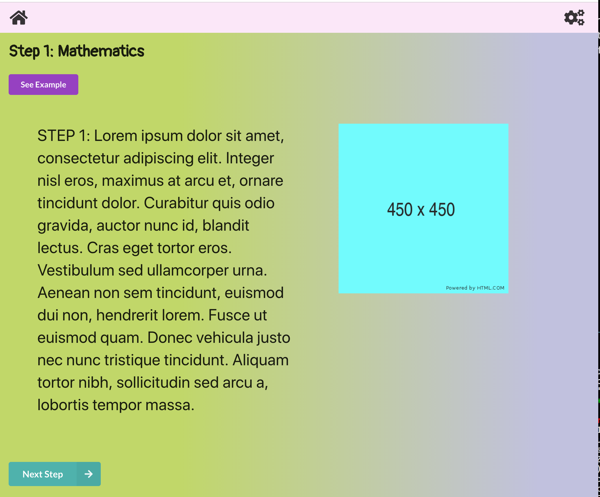

# Steppy App

- App Location: [https://steppy.netlify.com](https://steppy.netlify.com)
- API: https://teamthomais.herokuapp.com/lessons/
- Admin Console: 

This app was built using ReactJS, Python 2.7, and Flask.

Backend Repo: https://github.com/theriley106/Steppy

## Problem:
- Finding a solution when presented with a problem that isn’t familiar to her
- “Learning how to learn”
- Strengths/what’s helpful:
    - list/steps
    - Interpreting visuals
    - Getting active feedback
    - Reading within reason (not too long of passages)
    - Creating art
    - Topics of interest (science, animals, titanic, urban legends)
        - Great memory recall within these topics
encouragement

- **Weaknesses:**
    - Reading long passages
    - Finding steps to solve a problem\

- **Goal:**
    - Graphical interface product
    - How to identify the type of a problem
    - Set of algorithms/examples to help her solve a problem of that topic
        - Customizable - can add new topics as she learns more

### Home Screen

### Step Screens

### Example Screen

### Admin Screen
